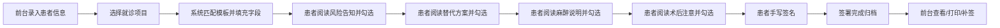

## 1. 产品概述

口腔诊所知情同意书 Web 签署台，面向诊所前台与咨询师，解决患者到院后反复填纸、医生找模板费时的问题。通过数字化流程自动生成同意书、引导患者签署、集中管理签署记录，提升中小型口腔门诊的接诊效率。

## 2. 核心功能

### 2.1 用户角色

| 角色 | 使用场景 | 核心权限 |
|------|----------|----------|
| 前台/咨询师 | 日常接诊 | 录入患者信息、选择就诊项目、生成同意书、查看签署记录、打印确认单 |
| 患者 | 到院就诊 | 阅读告知内容、勾选确认、手写签名 |

### 2.2 功能模块

1. **患者信息页**：患者基本信息录入、就诊项目选择（种植/拔牙/根管/正畸等）、模板自动匹配、字段自动填充预览
2. **同意书签署页**：分步引导（风险告知→替代方案→麻醉说明→术后注意→签名）、阅读勾选校验、手写签名画布
3. **签署记录页**：签署列表（未签/已签/需补签状态）、搜索筛选、详情查看、打印确认单

### 2.3 页面详情

| 页面名称 | 模块名称 | 功能描述 |
|----------|----------|----------|
| 患者信息页 | 患者信息表单 | 姓名、性别、年龄、病历号、联系电话、治疗牙位、费用说明录入 |
| 患者信息页 | 就诊项目选择 | 种植、拔牙、根管治疗、正畸、洗牙、补牙等项目卡片式选择 |
| 患者信息页 | 模板预览区 | 实时显示所选项目的同意书模板及已填充字段 |
| 患者信息页 | 操作按钮区 | 重置、保存草稿、生成同意书并进入签署 |
| 同意书签署页 | 顶部患者信息条 | 展示当前患者姓名、病历号、项目、牙位 |
| 同意书签署页 | 步骤进度指示器 | 5步进度条（风险告知/替代方案/麻醉说明/术后注意/签名） |
| 同意书签署页 | 内容阅读区 | 每项展示详细文字说明，底部需勾选"已阅读并理解" |
| 同意书签署页 | 签名画布 | 手写签名区，支持清除、重签，签名不能为空 |
| 同意书签署页 | 操作按钮 | 上一步/下一步/完成签署 |
| 签署记录页 | 状态筛选栏 | 全部/未签/已签/需补签 Tab 切换，日期范围、搜索 |
| 签署记录页 | 签署列表 | 表格展示患者、项目、签署时间、状态标签、操作列 |
| 签署记录页 | 详情弹窗 | 展示完整同意书内容、签名、签署时间戳 |
| 签署记录页 | 打印功能 | 生成可打印的 A4 确认单（含签名、二维码/水印） |

## 3. 核心流程

前台录入患者信息 → 选择就诊项目 → 系统匹配对应同意书模板 → 自动填充姓名/病历号/牙位/费用等字段 → 患者端分步阅读4项告知内容并逐项勾选 → 手写签名确认 → 系统记录已签状态并归档 → 前台可随时查询、补签或打印确认单

## 4. 用户界面设计

### 4.1 设计风格

- **主色调**：医疗蓝 `#1E88E5` 作为主色，搭配青绿色 `#26A69A` 强调专业与信任感
- **辅助色**：浅灰背景 `#F5F7FA`，白色卡片，状态色（未签橙 `#FB8C00`、已签绿 `#43A047`、补签红 `#E53935`）
- **按钮风格**：圆角 8px，实心主色按钮配白色文字，次要按钮为浅灰底
- **字体**：思源黑体 / PingFang SC，标题 18-22px 半粗，正文 14px，辅助文字 12px 浅灰
- **布局风格**：顶部导航 + 左侧状态区 + 右侧内容区，卡片式布局，适中留白
- **图标风格**：线性图标（如 Lucide），表情符号仅用于状态标签旁点缀

### 4.2 页面设计概览

| 页面名称 | 模块名称 | UI 元素 |
|----------|----------|---------|
| 患者信息页 | 信息表单 | 双列表单卡片，标签左对齐，输入框带内边距和聚焦蓝边 |
| 患者信息页 | 项目选择 | 横向滚动卡片，选中态蓝色边框+浅蓝底，带项目图标 |
| 患者信息页 | 模板预览 | 模拟 A4 纸张效果（阴影+微圆角），填充字段高亮显示 |
| 同意书签署页 | 步骤指示器 | 顶部水平步骤条，当前步骤蓝色高亮，已完成步骤显示勾号 |
| 同意书签署页 | 内容区 | 白色卡片内滚动阅读，标题深蓝色，正文行高 1.7 |
| 同意书签署页 | 勾选区 | 大复选框配醒目文字"我已阅读并理解以上内容"，未勾选时下一步灰掉 |
| 同意书签署页 | 签名区 | 浅灰边框画布，带网格纹理，下方"清除签名""确认签名"按钮 |
| 签署记录页 | 筛选栏 | Tab 切换带下划线动效，搜索框圆角，日期选择器 |
| 签署记录页 | 列表 | 斑马纹表格，状态标签带左彩色竖条，操作列图标按钮 |
| 签署记录页 | 打印页 | A4 尺寸白底，顶部诊所信息，中部同意书，底部签名与时间戳 |

### 4.3 响应式

桌面优先设计（最小宽度 1280px），签署页签名区支持触摸屏手写，签署记录表格横向滚动适配小屏。

### 4.4 动效细节

- 页面切换淡入淡出（200ms）
- 步骤切换横向滑动
- 按钮悬停轻微上浮 + 阴影加深
- 勾选完成时勾号圆圈动画
- 签名提交后成功反馈弹窗（含对勾动效）
