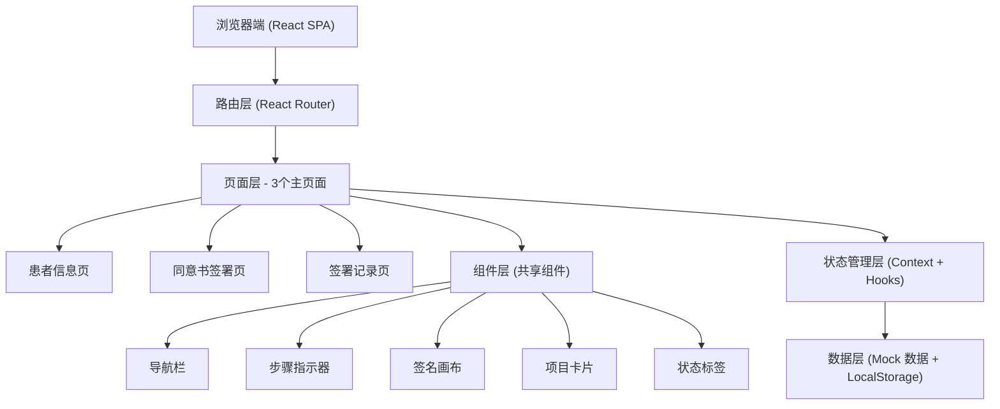
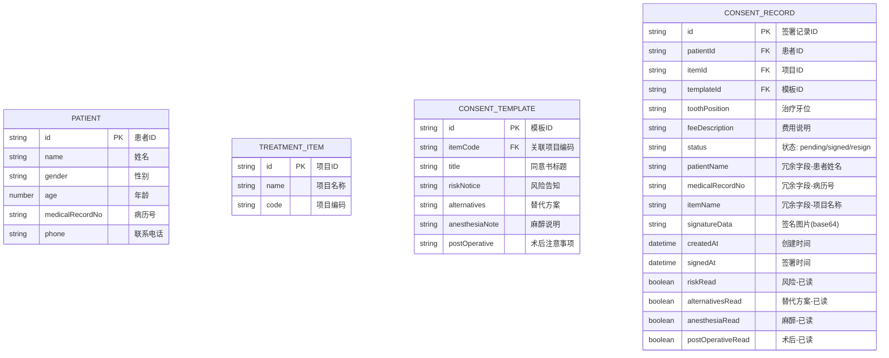

## 1. 架构设计



## 2. 技术描述

- **前端框架**：React@18 + TypeScript
- **构建工具**：Vite@5
- **样式方案**：TailwindCSS@3 + PostCSS
- **路由管理**：react-router-dom@6
- **图标库**：lucide-react
- **状态管理**：React Context + useReducer（轻量级全局状态）
- **数据持久化**：LocalStorage（模拟后端存储签署记录）
- **签名实现**：原生 Canvas API 封装手写签名组件
- **打印方案**：原生 window.print() + 专用打印样式 @media print

## 3. 路由定义

| 路由路径 | 页面名称 | 说明 |
|----------|----------|------|
| `/` | 患者信息页 | 默认首页，录入患者信息、选择项目、预览模板 |
| `/sign/:recordId` | 同意书签署页 | 分步引导患者阅读并签名 |
| `/records` | 签署记录页 | 展示所有签署记录，支持筛选/搜索/详情/打印 |

## 4. 数据模型

### 4.1 数据模型 ER 图



### 4.2 核心 TypeScript 类型定义

```typescript
interface Patient {
  id: string;
  name: string;
  gender: '男' | '女';
  age: number;
  medicalRecordNo: string;
  phone: string;
}

interface TreatmentItem {
  id: string;
  name: string;
  code: string;
  icon: string;
  description: string;
}

type ConsentStatus = 'pending' | 'signed' | 'resign';

interface ConsentRecord {
  id: string;
  patient: Patient;
  item: TreatmentItem;
  toothPosition: string;
  feeDescription: string;
  status: ConsentStatus;
  signatureData: string | null;
  createdAt: string;
  signedAt: string | null;
  readings: {
    risk: boolean;
    alternatives: boolean;
    anesthesia: boolean;
    postOperative: boolean;
  };
}

interface ConsentTemplateContent {
  title: string;
  riskNotice: string[];
  alternatives: string[];
  anesthesiaNote: string[];
  postOperative: string[];
}
```

## 5. 目录结构

```
src/
├── main.tsx                 # 入口文件
├── App.tsx                  # 根组件 + 路由配置
├── index.css                # Tailwind 入口 + 全局样式
├── assets/                  # 静态资源
├── components/              # 共享组件
│   ├── Layout.tsx           # 页面布局（导航栏+内容区）
│   ├── Navbar.tsx           # 顶部导航栏
│   ├── StepIndicator.tsx    # 签署步骤指示器
│   ├── SignaturePad.tsx     # 手写签名画布
│   ├── TreatmentCard.tsx    # 就诊项目卡片
│   ├── StatusBadge.tsx      # 状态标签
│   ├── ConsentPreview.tsx   # 同意书预览（A4纸张效果）
│   └── PrintLayout.tsx      # 打印布局
├── pages/                   # 页面组件
│   ├── PatientInfoPage.tsx  # 患者信息页
│   ├── SignPage.tsx         # 同意书签署页
│   └── RecordsPage.tsx      # 签署记录页
├── context/                 # 全局状态
│   └── ConsentContext.tsx   # 签署记录 Context
├── data/                    # Mock 数据与模板
│   ├── treatmentItems.ts    # 就诊项目列表
│   └── consentTemplates.ts  # 各项目同意书模板
├── hooks/                   # 自定义 Hooks
│   └── useLocalStorage.ts   # LocalStorage Hook
├── types/                   # TypeScript 类型
│   └── index.ts             # 类型导出
└── utils/                   # 工具函数
    ├── id.ts                # ID 生成
    └── date.ts              # 日期格式化
```

## 6. 签署完成确认单结构（打印页）

- **页眉**：诊所名称、地址、联系电话、Logo 占位
- **标题**：[项目名称]知情同意书确认单
- **患者信息区**：姓名、性别、年龄、病历号、联系电话、治疗牙位、费用说明
- **同意书正文区**：风险告知、替代方案、麻醉说明、术后注意事项（可折叠）
- **签名区**：患者签名（Canvas 生成的图片）、签署日期时间戳
- **页脚**：打印时间、水印"本确认单与纸质版具有同等效力"
